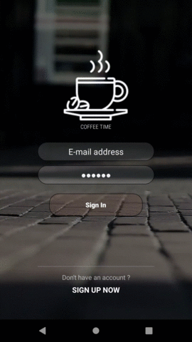

# VideoLayout

[](https://app.codacy.com/app/AsynctaskCoffee/VideoLayout?utm_source=github.com&utm_medium=referral&utm_content=AsynctaskCoffee/VideoLayout&utm_campaign=Badge_Grade_Dashboard)

> More stylish background designs
> Performance friendly and scalable

## Why this project exists
The normal videoview on Android is very costly in terms of performance. Also, due to the video resolution ratio and apk size, most developers don't want to include videos in the project. With this library, developers will have a performance-friendly video background with a few lines of code.

## Features and Usage

### Easy implementation 

```java
        frameLayout = findViewById(R.id.frameLayout)
        videoLayout = VideoLayout(this)
        videoLayout.setGravity(VideoLayout.VGravity.centerCrop)
        videoLayout.setIsLoop(true)
        videoLayout.setPathOrUrl("loginvideotype3.mp4") // could be any video url
        frameLayout.addView(videoLayout)
```

```xml    
    <egolabsapps.basicodemine.videolayout.VideoLayout
            android:id="@+id/videoLayout"
            android:layout_width="match_parent"
            android:layout_height="match_parent"
            android:layout_gravity="center"
            app:video_gravity="centerCrop"
            app:path_or_url="loginvideotype3.mp4"
            app:loop="true"/>
```

###### You should put your mp4 files into assets folder, If you use URL you should declare

```xml
   <uses-permission android:name="android.permission.INTERNET"/>
```

 

## Implementation

###### Add it in your root build.gradle at the end of repositories

```groovy
    repositories {
        maven { url 'https://jitpack.io' }
    }
```

###### Add the dependency

```groovy
    implementation 'com.github.AsynctaskCoffee:VideoLayout:1.0'
```

## License

```
   Copyright 2019 Egemen ÖZOGUL

   Licensed under the Apache License, Version 2.0 (the "License");
   you may not use this file except in compliance with the License.
   You may obtain a copy of the License at

       http://www.apache.org/licenses/LICENSE-2.0

   Unless required by applicable law or agreed to in writing, software
   distributed under the License is distributed on an "AS IS" BASIS,
   WITHOUT WARRANTIES OR CONDITIONS OF ANY KIND, either express or implied.
   See the License for the specific language governing permissions and
   limitations under the License.
```
